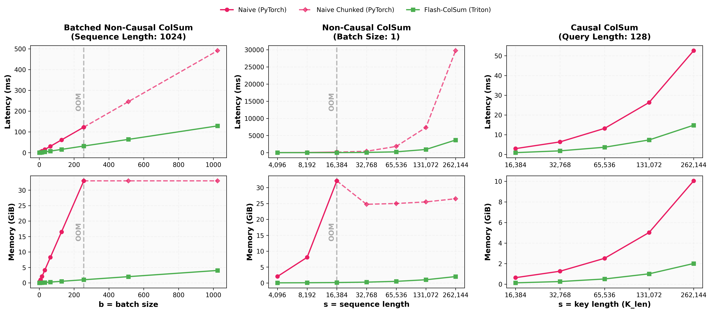
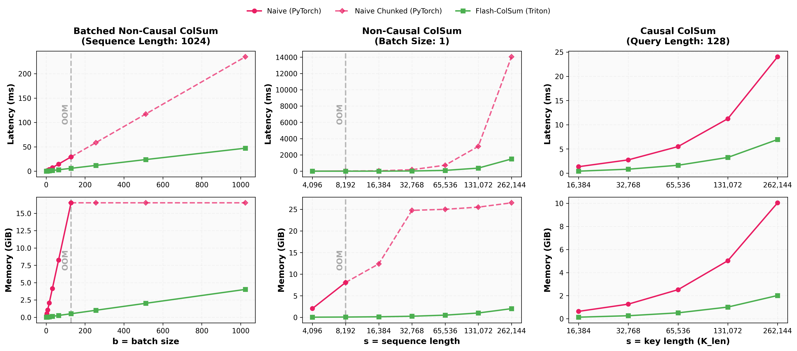

# Flash-ColSum

**Efficient attention column-sum primitives with Triton kernels.**

[](https://pypi.org/project/flash-colsum/)
[](LICENSE)
[](https://www.python.org/downloads/)

**Flash-ColSum** provides highly optimized Triton kernels for computing the column sums (or means) of the attention matrix **without materializing the full $O(N^2)$ attention weights**. 

This primitive is essential for efficient KV-cache pruning, token importance estimation, and attention analysis in Large Language Models (LLMs) and Vision-Language Models (VLMs), such as [SparseVILA](https://arxiv.org/abs/2510.17777).

## Why Flash-ColSum?

- **Memory Efficiency**: Computes column statistics in $O(N)$ memory instead of $O(N^2)$, allowing processing of very long sequences (e.g., 128k+) on a single GPU.
- **Speed**: Fused Triton kernels minimize HBM reads/writes, significantly outperforming naive PyTorch implementations.
- **Flexibility**: Supports both **Causal** (autoregressive) and **Non-Causal** (bidirectional) attention patterns, including irregular shapes (e.g., $M \neq N$).

## Features

- ⚡ **Fused Kernels**: Online softmax and reduction fused into a single kernel.
- 📐 **Flexible Shapes**: Handles batched inputs, non-square attention ($Q_{len} \neq K_{len}$), and multi-head attention.
- 🎭 **Causal Masking**: Correctly handles right-aligned causal masking for autoregressive decoding (where later keys are attended to by fewer queries).
- 📊 **Weighted Means**: Built-in support for computing column means with correct normalization factors for causal masking.

## Installation

Install from PyPI:
```bash
pip install flash-colsum
```

Or build from source:
```bash
git clone https://github.com/z-lab/flash-colsum.git
cd flash-colsum
pip install -e .
```

## Usage

### Basic Example (Non-Causal)

Compute the column sum of the attention matrix for standard bidirectional attention.

```python
import torch
from flash_colsum import flash_colsum

device = "cuda"
dtype = torch.float16

# Shapes: (Batch, Heads, Seq_Len, Head_Dim)
Q = torch.randn(8, 16, 512, 64, device=device, dtype=dtype)
K = torch.randn(8, 16, 512, 64, device=device, dtype=dtype)

# Returns: (Batch, Key_Len)
# Aggregated over all queries and heads
col_sum = flash_colsum(Q, K) 
print(col_sum.shape) # (8, 512)
```

### Causal Attention (KV Cache Scenarios)

Handle autoregressive attention where $M \neq N$ (e.g., decoding steps or prompt processing).

```python
import torch
from flash_colsum import flash_colsum, flash_colmean

# Example: Single sequence, 32 heads, 128 new queries, 4096 existing keys
Q = torch.randn(1, 32, 128, 128, device="cuda", dtype=torch.float16)
K = torch.randn(1, 32, 4096, 128, device="cuda", dtype=torch.float16)

# Compute column sums with causal masking (right-aligned)
# Keys at the end of the sequence are attended to by fewer queries.
col_sum = flash_colsum(Q, K, is_causal=True) # Shape: (1, 4096)

# Compute column means (automatically handles the varying denominator due to masking)
col_mean = flash_colmean(Q, K, is_causal=True) # Shape: (1, 4096)
```

## API Reference

### `flash_colsum(query, key, scale=None, is_causal=False)`

Computes $S_{b,k} = \sum_{h, m} \text{Softmax}(Q K^T)_{b,h,m,k}$.

- **query**: `(B, H, M, D)`
- **key**: `(B, H, N, D)`
- **is_causal**: If `True`, applies a right-aligned causal mask. Useful when $K$ represents a KV cache and $Q$ represents new tokens.
- **scale**: Softmax scaling factor. Defaults to $1/\sqrt{D}$.
- **Returns**: `(B, N)` tensor containing the sum of attention weights for each key position.

### `flash_colmean(query, key, scale=None, is_causal=False)`

Computes the average attention weight per key token. This is a convenience wrapper around `flash_colsum` that divides by the correct number of participating queries for each key (which varies in the causal case).

## Performance

Flash-ColSum achieves significant speedups and memory savings over naïve implementations. By fusing the softmax and reduction steps, it avoids writing the huge $B \times H \times M \times N$ matrix to GPU memory.


*Benchmarked on NVIDIA RTX A6000 with FP16 precision*


*Benchmarked on NVIDIA GeForce RTX 5090 with FP16 precision*

## Development

### Project Structure
```
flash-colsum/
├── flash_colsum/          # Source code
│   ├── flash.py           # Triton kernels & API
│   └── naive.py           # Reference PyTorch implementations
├── benchmarks/            # Performance scripts
└── tests/                 # Correctness tests
```

### Running Tests
```bash
# Install test dependencies
pip install -e ".[test]"

# Run correctness tests
pytest -v
```

### Running Benchmarks
```bash
# Run benchmark sweeps
FLASH_COLSUM_RUN_BENCH=1 pytest tests/test_benchmarks.py -v -s
```

## Citation

If you use Flash-ColSum in your research, please cite the SparseVILA paper:

```bibtex
@InProceedings{Khaki_2025_ICCV,
    author    = {Khaki, Samir and Guo, Junxian and Tang, Jiaming and Yang, Shang and Chen, Yukang and Plataniotis, Konstantinos N. and Lu, Yao and Han, Song and Liu, Zhijian},
    title     = {SparseVILA: Decoupling Visual Sparsity for Efficient VLM Inference},
    booktitle = {Proceedings of the IEEE/CVF International Conference on Computer Vision (ICCV)},
    month     = {October},
    year      = {2025},
    pages     = {23784-23794}
}
```

## License

[MIT License](LICENSE)

## Acknowledgments

- **[FlashAttention](https://github.com/Dao-AILab/flash-attention)**: The tiling and online softmax approach is heavily inspired by FlashAttention.
- **[SparseVILA](https://arxiv.org/abs/2510.17777)**: The original project that necessitated this primitive.
